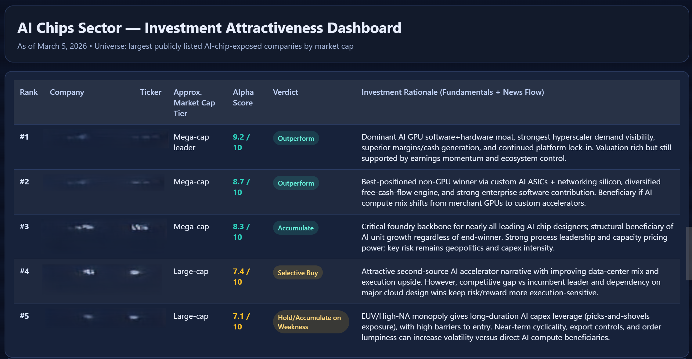

# Microsoft Foundry: Real-Time Stock Analyst with GPT-5.3-Codex, MCP & Web Search tools (Agents v2)

This repo demonstrates the use of a financial analyst agent, built in Microsoft Foundry's new **Agent Service** and powered by **GPT-5.3-Codex**. The solution implements a two-step retrieval process with **Web Search** and the **Model Context Protocol (MCP)** tools to provide the *Codex* model with the latest stock market context.

> [!TIP]
> This solution utilises protected Alpha Vantage MCP service. You can obtain *free API key* from the vendor site here: https://www.alphavantage.co/support/#api-key.

## 📑 Table of Contents:
- [Part 1: Prerequisites](#part-1-prerequisites)
- [Part 2: Environment Setup](#part-2-environment-setup)
- [Part 3: Agent Configuration & Tools](#part-3-agent-configuration--tools)
- [Part 4: Execution Workflow](#part-4-execution-workflow)
- [Part 5: Testing the Agent]()

## Part 1: Prerequisites
Before running this solution, ensure that you have:
- **Azure Subscription** with access to **Microsoft Foundry** project;
- **Alpha Vantage API Key** for the real-time stock market content.

## Part 2: Environment Setup

### 2.1 Azure AI Foundry Setup
If not available yet, create a new Microsoft Foundry project and deploy the required *Codex* model (e.g., **GPT-5.3-Codex**).

### 2.2 Environment Variables
Configure the following variables to allow the notebook to authenticate and connect to your resources:

| Environment Variable             | Description                                                |
| -------------------------------- | ---------------------------------------------------------- |
| `AZURE_FOUNDRY_PROJECT_ENDPOINT` | Your Microsoft Foundry Project connection string.          |
| `AZURE_FOUNDRY_CODEX_MODEL`      | The deployment name of your model (e.g., `gpt-5.3-codex`). |
| `ALPHAVANTAGE_API_KEY`           | Your personal API key for stock data retrieval.            |

## Part 3: Agent Configuration & Tools

### 3.1 Tool Definitions
The agent is equipped with two tools to enable retrieval of the latest stock market information for the requested industry sector:
- **WebSearchTool**: Used to crawl the live web and identify current market leaders by ticker;
- **MCPTool**: Connects to the Alpha Vantage's MCP service to fetch specific fundamentals and news once tickers are identified.

``` Python
tools = [
    WebSearchTool(
        user_location = WebSearchApproximateLocation(country = "GB", city = "London")
    ),
    MCPTool(
        server_label = "alpha_finance",
        server_url = f"https://mcp.alphavantage.co/mcp?apikey={ALPHAVANTAGE_API_KEY}",
        require_approval = "never"
    ),
]
```

## Part 4: Execution Workflow
The agent follows a logical sequence to ensure output accuracy:
- **Ticker Retrieval**: The agent uses *Web Search* tool first to identify the *top 5* publicly listed companies in a requested sector based on current market capitalisation.
- **Context Enrichment**: For each identified ticker, the agent calls the *MCP* tool to retrieve up-to-date fundamentals and recent news.
- **Synthesis**: The *Codex* model processes the combined search and MCP data to rank investments and generate the final output.

This sequence is managed through the agent's intsructions:

``` JSON
You are a financial analyst called The Alpha Finder.
You have two tools: web search and an alpha_finance MCP tool.

When given a sector:
1. Use web search to identify the top 5 publicly listed companies in that sector RIGHT NOW
   by market capitalisation. Extract their ticker symbols.
2. For each ticker, use the MCP tool to fetch live fundamentals and recent news.
3. Rank them by investment attractiveness with clear rationale.
4. Output ONLY a single self-contained dark-theme HTML dashboard showing the full analysis.
   No explanation, no markdown fences — just the HTML.
```

## Part 5: Testing the Agent

### 5.1 Run the Analysis
Execute the provided Jupyter notebook `AIFoundry_GPT53Codex_StockDemo.ipynb`. The agent will generate a self-contained HTML dashboard directly in the output cell.


### 5.2 Housekeeping
The notebook includes a cleanup step to delete the agent version and close client connections once the analysis is complete to manage project resources efficiently.

``` Python
project_client.agents.delete_version(agent_name=agent.name, agent_version=agent.version)
project_client.close()
```
